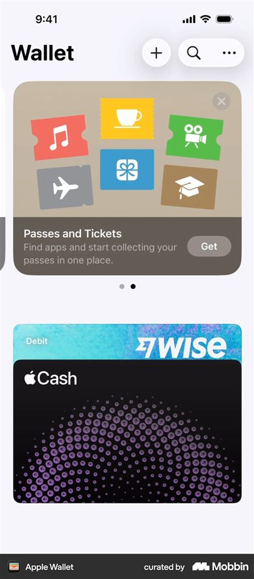

# Bingd — Design System

**Version:** v2
**Status:** Draft for review
**Date:** 2026-08-15 (v1 was 2026-08-13)
**Specification:** [`../product/PRD.md`](../product/PRD.md) §5, §10 · [`../architecture/client.md`](../architecture/client.md) §4

The PRD fixes the palette, the typefaces, and the voice. This document turns those into values a component can consume, and resolves the places where the brand as written does not survive contact with a real screen.

> **What changed in v2.** Two founder decisions on 2026-08-15, both recorded in [`decision-log.md`](../product/decision-log.md) §12. The ranking output is now a 0–10 score rather than an ordinal, which replaces the rank badge in §8 and the reveal in §9. And the base surface moved from Parchment to a warm near-white, which rewrites §1 and §2 and relaxes two rules v1 stated absolutely. Where v1 was reversed, this document says so rather than quietly reading as though it always said the new thing — the reasoning behind a rule is worth more than the rule.

---

## 1. Three problems in the palette

All were found by measuring the PRD §5 colors rather than by looking at them.

### Antique Amber and Muted Sage cannot carry text

Measured against the base surface, Paper `#FBF8F4`:

| Foreground | Ratio | WCAG AA body (4.5:1) | WCAG AA large (3:1) |
|---|---|---|---|
| Ink `#242326` | 14.8:1 | pass | pass |
| Bingd Maroon `#773744` | 8.2:1 | pass | pass |
| Muted Sage `#92A895` | **2.4:1** | **fail** | **fail** |
| Antique Amber `#D4A64C` | **2.1:1** | **fail** | **fail** |

Amber and Sage are mid-luminance colors sitting on a light background. No text size rescues them — even at display size they fall below the 3:1 large-text floor, and the lighter base bought only 0.2 of a point. It was never the background's fault.

This caught one already-written instruction. [`client.md`](../architecture/client.md) §5 specified the ranking reveal as "Antique Amber for the ordinal," which would have rendered the single most important number in the product at 2.1:1 — effectively invisible in daylight and to anyone with low vision. That section has been corrected.

**Resolution.** Amber and Sage are **fill colors, never ink**. Where the PRD calls for amber emphasis, amber becomes the surface and Ink sits on top of it, which measures 7.0:1 — the goal bar's completed fill is the remaining instance. The reveal was specified this way too until 2026-08-16, when it moved to the Maroon score pair for the reason in §9; the rule did not change, only which certified pair that one panel uses. Both remain available for non-text use — rings, bars, dots, illustration — but at 2.4:1 and 2.1:1 they fail the 3:1 non-text threshold too, so even there they need an Ink hairline to define their edge.

### Posters fought Parchment, and Parchment lost

Movie posters are dark, saturated, full-bleed rectangles. Letterboxd works because its background is near-black, so artwork sits in a void and the interface disappears. Parchment `#F5EBDD` did the opposite: every poster became a loud object on a quiet page.

v1 tried to solve this by disciplining the artwork — following Apple Wallet's model of the printed card, and adding one rule Wallet does not need: **artwork is the only color on a content surface**, no full-bleed anything.



That rule held for as long as the app was rows of small posters. It did not survive the 2026-08-15 direction, which wants poster grids, horizontal shelves, a full-bleed hero on every title page, and a chromatic score badge on every row. Each of those was individually reasonable and collectively impossible on Parchment, because **Wallet's real trick is the one thing v1 copied least: Wallet's background is near-white.** Parchment is chromatic — a saturated warm ground has less headroom before artwork starts competing, and v1 spent that headroom on the background itself rather than on the content.

**Resolution: move Parchment down the stack rather than out of the system.** The base surface becomes **Paper `#FBF8F4`** — the same hue family with most of the saturation removed — and Parchment becomes the warm accent *above* it: wells, inputs, chips, selected tabs, poster placeholders, share cards. The brand still reads warm, because warmth now comes from the elements a user touches instead of from the empty space behind them, and that is a better place for it. Nothing is deleted; PRD §5's palette is intact.

Two rules from v1 are relaxed, deliberately and by name:

- **Artwork is no longer the only color on a content surface.** The score badge (§8) is chromatic on every row, because a number that has to be read at a glance cannot be a grey circle. Nothing else joins it.
- **One full-bleed surface exists**: the hero on the title page. It is the only place artwork is allowed to run to the edge or sit behind text, and the text on it gets a scrim, not hope.

Everything else survives. Posters are still printed objects: 2:3 crop, hairline Ink border, soft warm shadow, real margins. An archive of printed cards on paper is still what "keep what you watch" should feel like — the paper just got less yellow.

The full poster rules are in §7.

### Stone is not quite a neutral

Stone `#9A8F86` measures 3.0:1 on Paper. That is above the 3:1 non-text floor and well below the 4.5:1 body floor, which puts it in the one band that invites a mistake: it is legible enough as a border or a fill to look like it might work as text, and it does not. Stone is a **fill**, like Amber and Sage, and §3's certified pair for it is Ink on top at 4.9:1.

---

## 2. Color tokens

### Brand — fixed by PRD §5, not open to adjustment

```ts
export const brand = {
  paper:     '#FBF8F4',  // added 2026-08-15 as the base surface
  parchment: '#F5EBDD',  // demoted from background to warm accent
  maroon:    '#773744',
  ink:       '#242326',
  amber:     '#D4A64C',
  sage:      '#92A895',
  midnight:  '#19242D',  // reserved, not used in v1
} as const;
```

### The surface ramp

Three surfaces, ordered by how far above the page they sit. Getting the direction right matters: `raised` is *lighter* than `base` and `sunken` is *warmer*, so a card lifts by going toward white and a well recedes by going toward Parchment. That is how paper behaves under a warm light, and it is why the app can use two of its own brand colors as surfaces without either looking like a mistake.

| Token | Value | Use |
|---|---|---|
| `surface.base` | `#FBF8F4` Paper | Screen background, the neutral behind everything |
| `surface.raised` | `#FFFFFF` | Cards, sheets, anything above the page |
| `surface.sunken` | `#F5EBDD` Parchment | Inputs, wells, chips, selected tabs, skeletons, poster placeholders — and where the brand's warmth now lives |

Pure white for `raised` is a deliberate choice and the one value here that could reasonably have gone another way. A card only reads as raised if it is lighter than its surroundings, and Paper is already close enough to white that a tinted card would be indistinguishable from the page. White also gives posters their maximum headroom, which is the point of §1.

### Text

| Token | Value | On Paper | On Parchment | Use |
|---|---|---|---|---|
| `text.primary` | `#242326` | 14.8:1 | 13.3:1 | |
| `text.secondary` | `#5F5A56` | 6.4:1 | 5.8:1 | Supporting copy |
| `text.tertiary` | `#6E6862` | 5.2:1 | 4.7:1 | Timestamps, counts, metadata |
| `text.onFill` | `#242326` | — | — | Ink on Amber (7.0:1), Sage (6.1:1) or Stone (4.9:1) |
| `text.inverse` | `#F5EBDD` | — | — | Parchment on Maroon (7.4:1) |

Every tone is quoted against both surfaces because both are real backgrounds now, and `tertiary` on Parchment at 4.7:1 is the tightest pair in the system — a metadata line inside a warm well is the thing to check first if a tone is ever adjusted.

`text.inverse` stays Parchment rather than becoming Paper. Paper on Maroon measures 8.2:1 against Parchment's 7.4:1, so the swap would have been a small win on contrast and a loss everywhere else: Parchment on Maroon is the brand's warm-on-deep pairing, it is what the wordmark does, and a near-white label on a maroon button reads as generic in a way the warmer one does not. 7.4:1 clears AA with room to spare, so there is nothing to buy.

There is no lighter tertiary. A fourth text tone would fall below 4.5:1 on Parchment, and the honest fix for "this is less important" is smaller type or more space, not weaker contrast.

### Borders

| Token | Value | Use |
|---|---|---|
| `border.hairline` | Ink @ 12% | Default separation, poster edges |
| `border.strong` | Ink @ 24% | Focus, selected outlines, input borders, the unranked score badge |

### Semantic

```ts
export const semantic = {
  action:        brand.maroon,      // primary buttons, links, selected
  actionText:    '#F5EBDD',
  score:         brand.maroon,      // every stated 0–10 score: badge, community, reveal
  scoreInk:      '#F5EBDD',         // 7.4:1 on score
  emphasis:      brand.amber,       // milestone fills
  progress:      brand.sage,        // watched, completed, sync success
  danger:        brand.maroon,      // destructive confirmation
  focusRing:     brand.maroon,
} as const;
```

Destructive actions reuse Maroon rather than introducing red. The palette has no red, a new one would compete with the brand color, and destructive actions in this product are rare and always confirmed with words. The confirm button is labeled with the verb — "Delete list" — never a bare "OK," so color is never the only signal that something is irreversible.

---

## 3. The bucket scale

Three buckets, always in this order, always with a label.

| Bucket | Color | Token | Score range | Ink on fill |
|---|---|---|---|---|
| I liked it | Bingd Maroon `#773744` | `bucket.loved` | 10.0 – 7.0 | — uses `text.inverse` at 7.4:1 |
| It was fine | Muted Sage `#92A895` | `bucket.fine` | 6.9 – 3.5 | 6.1:1 |
| I didn’t like it | Stone `#9A8F86` | `bucket.notForMe` | 3.4 – 0.0 | 4.9:1 |

These three pairs are the **certified fills**: the only combinations in the system where a brand color carries text, and the reason the score badge in §8 can be chromatic at all. Nothing else may be used as a fill behind a label without being measured and added here.

**Stone is a derived warm grey**, named so it cannot be mistaken for a brand accent. It reads as receded rather than as a rejection, which matches the product's position: the buckets express *for me* and *not for me*, not good and bad.

Three deliberate choices here.

**Not red, yellow, green.** That triad is Beli's, borrowed from food safety, and it says "bad, mediocre, good" about the film rather than about the viewer's response to it. It also fails for the roughly one in twelve men with red-green color vision deficiency, and green and red are both absent from Bingd's palette.

**Amber is excluded**, even though it is the obvious middle color. Amber's job in this system is milestones and awards. Using it for "it was fine" would spend the product's celebration color on its most neutral state, and after a few weeks of use amber would read as *unremarkable* everywhere it appears.

**Color is never the only signal.** Every bucket indicator carries its label, or a number that states the same thing. The score badge in §8 satisfies this without a label because the score itself encodes the bucket — the ranges do not overlap, so `8.7` *is* "I liked it" whether or not the fill is visible. A bare colored dot with nothing in it is never acceptable.

Unselected chips render as an outlined ring in the bucket color on `surface.raised`; the selected chip fills and adds a checkmark. This is the interaction from Beli 224 and it works because selection is signalled by fill, checkmark, and border simultaneously.

---

## 4. Typography

**DM Serif Display** ships Regular and Italic only — there is no bold. Any design that needs a heavier serif is not achievable, so serif emphasis must come from size and space. This is a real constraint and it is easy to discover too late.

**Inter** at 400, 500, and 600. Not 700; at these sizes 600 is enough, and capping the range keeps the type feeling calm.

Both are bundled as local assets and never fetched at runtime — the same failure the brand SVGs currently have (PRD §5).

| Token | Family | Size / line | Use |
|---|---|---|---|
| `reveal` | DM Serif Display | 88 / 88 | The score in the ranking reveal. Nowhere else |
| `display` | DM Serif Display | 40 / 44 | Share cards, milestone moments |
| `title1` | DM Serif Display | 28 / 34 | Editorial screen titles, the medium dropdown |
| `title2` | DM Serif Display | 22 / 28 | Title names |
| `headline` | Inter 600 | 17 / 22 | Row titles, buttons |
| `score` | Inter 600 | 17 / 20, tabular | The number inside a score badge (§8) |
| `body` | Inter 400 | 16 / 24 | Notes, descriptions, prose |
| `callout` | Inter 500 | 15 / 20 | Secondary actions, chip labels |
| `subhead` | Inter 500 | 14 / 20 | Field labels, metadata headers |
| `footnote` | Inter 400 | 13 / 18 | Timestamps, counts |
| `caption` | Inter 500 | 12 / 16, +0.2 tracking | Overlines, tab labels |
| `sectionHeader` | Inter 600 | 12 / 16, +0.6 tracking, uppercase | Section headers (§8) |

`score` is tabular so a column of badges does not jitter between `8.7` and `10.0`, and it is the one place the app sets a number in Inter 600 rather than serif — a serif score reads as editorial rather than as data, and DM Serif has no bold to fall back on.

**Section headers moved from `subhead`/tertiary to `sectionHeader`/Maroon.** At `subhead` in `text.tertiary` they measured 5.2:1, technically passing and visibly faint — small, low-contrast, and low-weight all at once, so they read as disclaimers rather than as structure. Maroon at 8.2:1 makes them the one place brand color does organisational work, and dropping to 12pt with tracking keeps them from competing with the row titles beneath.

**Dynamic Type is supported** across the whole app. `reveal` and `display` cap at 130% because they are already display-scale and clip before they help; everything else scales without a ceiling. No token ever scales below 100%. Layouts that break at 200% are bugs, not acceptable trade-offs — the ranking list, the comparison screen, and settings are the three most likely to break and are called out in [`screens.md`](./screens.md).

---

## 5. Space

A 4pt base. Screen gutter 16. Gap between sections 24. Card padding 16.

```ts
export const space = { 1: 4, 2: 8, 3: 12, 4: 16, 5: 20, 6: 24, 8: 32, 10: 40, 12: 48, 16: 64 };
```

PRD §5 asks for airy onboarding, comparison, reveal, and share surfaces, and efficient rows on Rankings and Search. In practice that means those two groups use different vertical rhythms: **airy surfaces** use 24 and 32 between elements and center their content vertically; **efficient surfaces** use 12 between rows with a 56pt minimum row height.

### The bottom edge belongs to whatever is at the bottom (2026-08-15)

`Screen` adds bottom padding only when asked, and every screen inside the tab navigator asks for none. It used to add 16pt unconditionally, which put a strip of Paper between the scroll view and the tab bar — content was clipped at the top of that strip instead of scrolling under the bar, and the strip read as a gap the Android system navigation bar was sitting on.

Android draws edge to edge from SDK 57. The tab bar is sized by the navigator to `49 + insets.bottom` and paints `surface.raised` across the whole of it, so its surface is what appears behind the system navigation buttons — the app has no separate bar to colour, and SDK 57 removed the `androidNavigationBar` config key for exactly that reason. The buttons are dark because `userInterfaceStyle` is `light`, and dark buttons are also what keeps Android from drawing its own contrast scrim behind them, which is the other half of the band.

Screens outside the navigator pass `includeBottomInset` and get `max(insets.bottom, 16)`. Scroll views set their own bottom padding in `contentContainerStyle`, which is the right place for it, because it scrolls.

---

## 6. Radius, elevation, motion

**Radius.** Cards 12, controls 8 (buttons, inputs, chips), sheets 20 on the top corners only, avatars full-round. No pill buttons — PRD §5.

**Elevation.** Two levels, both using Ink rather than black. Pure black shadow on a warm background reads as a grey smudge.

| Token | Shadow | Use |
|---|---|---|
| `e1` | `0 1px 2px` Ink @ 6% | Raised cards, poster md and above |
| `e2` | `0 8px 24px` Ink @ 14% | Sheets, popovers |

**Motion.** 120ms for state changes, 200ms for sheets, 260ms for navigation, standard easing. The ranking reveal is the single exception (§9).

`prefers-reduced-motion` is honored everywhere. When it is set, the reveal becomes a cross-fade of the same composition — the moment still happens, it just does not move.

---

## 7. Posters

Artwork always renders 2:3, the TMDB standard. Anything else is letterboxed against `surface.sunken`, never stretched.

| Token | Size | Use |
|---|---|---|
| `poster.row` | 38 × 57 | The compact list row (§8). Sized to the row's text block, not the other way round |
| `poster.xs` | 40 × 60 | Feed title cards, tag rows |
| `poster.sm` | 56 × 84 | Anywhere a row is deliberately roomier than the default |
| `poster.md` | 88 × 132 | Shelves, list previews |
| `poster.lg` | 132 × 198 | Title detail, recommendation cards |
| `poster.xl` | 180 × 270 | Comparison cards, share cards |

`poster.row` exists because the row was being sized by its artwork. A `poster.sm` thumbnail is 84pt tall, so pinning a row's text block to the poster height produced an 84pt row for two lines of type — artwork dictating rhythm. At 38 × 57 the poster is a shade shorter than a two-line text block, so the type sets the row height and the image fits inside it. This is the Letterboxd diary row, and it is the densest legible form of "a film in a list."

Rules that make artwork sit on a light ground:

- **Hairline border**, Ink @ 12%, inset. Without it, pale posters dissolve into the page.
- **Radius 6 below 60pt wide, 8 below 100pt, 12 at or above.** A 12pt radius on a 40pt thumbnail eats the artwork; the rule keeps the *visual* corner constant as the poster scales, which is what PRD §5's 12px card radius is actually asking for.
- **Shadow `e1` at md and above only.** Small posters with shadows produce visual noise in a list.
- **Full-bleed exists exactly once**: the title page hero (§1, [`screens.md`](./screens.md)). Everywhere else keeps a minimum 16pt margin of Paper on every screen edge, and no artwork sits behind text without a scrim.
- **Grids and shelves keep tight gutters.** 4–6pt between posters in a grid, 8–12pt in a shelf. Wide gutters on a light ground make a grid read as scattered rather than as a wall.
- **Artwork and the score badge are the only color present.** On any surface showing posters, everything else is Ink, Paper, Parchment, or a derived neutral. Amber and Sage never appear near artwork (§1).
- **Missing artwork is a designed state**, not a broken image: `surface.sunken` fill, the title's first two initials in DM Serif Display, `text.tertiary`. This will be common, because the seed catalogue ships without posters and Letterboxd imports reach obscure titles no provider has art for.

> **The initials must come from the title.** Passing any other string produces confident nonsense: an activity feed that passed its whole sentence in rendered "Someone ranked a title." as **SR**, which looked exactly like a real two-letter poster and was therefore not noticed for a while.

---

## 8. Components

Specified by anatomy and rules rather than by pixel measurements, which belong in code.

### Button

Three kinds. Primary is Maroon with `text.inverse`. Secondary is `surface.raised` with a `border.strong` outline and Ink label. Tertiary is a bare Ink label with no container.

Minimum height 48, minimum tap target 44 × 44, radius 8, `headline` label. One primary per screen. Disabled state reduces opacity to 40% **and** the button announces why it is disabled to screen readers — an unexplained dead button is the most common accessibility failure in this pattern.

### Bucket chip

The triad from §3. Three chips in a row, equal width, each an outlined circle above its label. Tapping fills the circle, adds a checkmark, and leaves the other two outlined. Selecting a bucket never starts comparisons on its own — that is a separate deliberate action (PRD §11, [`api.md`](../architecture/api.md) §1).

### Score badge

> **Replaces the rank badge.** v1 specified the ordinal `#18` and said "never rendered as a score, percentage, ring, or bar." Reversed by the founder on 2026-08-15; the reasoning is in PRD §4 and the derivation in §10.

A **filled circle** in the title's bucket color, with the score in `score` type in that fill's certified ink (§3).

| Size | Diameter | Where |
|---|---|---|
| `md` | 44 | Collection rows, search results, title page |
| `sm` | 36 | Feed items, profile poster overlays |

Filled, not outlined. Beli's badge is an outline circle whose stroke and number share a color that tracks the score, and that cannot be reproduced here: an outline in Sage measures 2.4:1 and in Stone 3.0:1, so two of the three buckets would ship a number below the body-text floor. Filling the circle inverts the problem — the fill carries the color, the ink carries the contrast, and all three pairs in §3 clear AA. It is a more assertive badge than Beli's, which suits a list that is read at arm's length.

**Unranked is a real state with its own rendering**: a dashed `border.strong` ring, no number, and the label `Rank` in `caption`/`text.tertiary`. It is a button. Never `0.0`, never `#—`, never a dimmed number — a title with no score has not failed to get one, it just has not been compared yet (PRD §26.4 AC 2).

Never a percentage, a ring gauge, a progress bar, or a 0–100 value. Never an average across users.

### Title row

The compact form, ~60pt: `poster.row` (38 × 57), then title and year on one line, then a metadata line, then a trailing score badge. The text block sets the height and the poster fits within it — never the reverse (§7).

The metadata line carries **runtime and genres**: `148m · Action · Adventure`. It does *not* carry the bucket label or the score, because the badge already says both. A row that reads `I liked it · #4 in Movies` next to a badge reading `8.7` is saying one thing three times.

### Comparison card

`poster.xl`, title beneath in `title2`, nothing else. The card is deliberately bare — no year, no runtime, no genre, no score. Every additional element is something the user reads instead of deciding, and the mechanic depends on feeling fast.

The comparison target does **not** show its current position or score — founder decision, 2026-08-13. Showing it turns a gut call into arithmetic, and the mechanic depends on the answer being instinctive ([`screens.md`](./screens.md) §4). The score badge is the app's most repeated element, so this is the one screen it must be kept off deliberately.

### Sheet

Radius 20 top corners, `surface.raised`, `e2`, drag handle, no dimmed backdrop below 40% — a warm light ground behind a heavy scrim turns muddy rather than dark. Sheets are the primary modal pattern; full-screen modals are reserved for onboarding and the reveal.

### Empty state

Illustration or large glyph, a `title2` line in DM Serif Display, one `body` line, and exactly one action. Written in the Curious Collector voice: "Nothing here yet" rather than "No results found."

Every list surface needs three distinct empty states that are frequently collapsed into one by mistake: **nothing yet** (new user), **nothing matches** (filter applied), and **could not load** (network or server). They read differently and offer different actions.

### Section header

`sectionHeader` type in Maroon, uppercase, at the screen gutter. One line, no rule beneath it. An optional trailing chevron makes the whole header a button to the full list, which is the Apple TV shelf pattern.

The gutter is load-bearing and is the thing that breaks: a header rendered without the screen's horizontal padding sits flush against the display edge while every row below it is inset by 16, and the result reads as a layout bug rather than as a header. Use the component; do not re-implement it with a bare `Text`.

### Poster shelf and poster grid

Two ways to show artwork in bulk, both from §7's rules. They are the app's only decorative surfaces and they earn it by being *low-detail on purpose* — a wall of covers is atmosphere, and any label on it competes with the next screen the user is trying to reach.

**Shelf.** Horizontal scroll of `poster.md`, 8–12pt gutters, a section header above it, and the last card clipped at roughly 70% so the row visibly continues. That clip is the whole affordance; a shelf that ends flush looks like a complete set.

**Grid.** Three columns, 4–6pt gutters, radius 8, no titles. Titles under a grid double its height and halve how much of a collection is visible at once, which is the opposite of what a grid is for. Every tile is a button to its title page, and the accessibility label carries the name and year the tile does not show.

A shelf gets a real reason for its title — "Because you loved Inception", "From your watchlist" — never "Recommended for you". PRD §13 requires every recommendation to carry an explanation derived from stored signals, and the shelf header is where that explanation lives.

### Loading

Three states, and using the wrong one is the common failure:

- **Cold launch**, before the JS bundle can render anything: the native splash. Brand mark on `surface.base`, no spinner, no text.
- **The app is up but the session is not resolved**: the full-screen loader. A rounded-square tile in `surface.raised` at radius 20 with `e1` and the brand mark inside, the wordmark beneath it, and a small Maroon activity indicator. It is the only place the app shows an indeterminate spinner, because it is the only wait whose length is genuinely unknown.
- **A list whose shape is known**: skeleton rows in `surface.sunken`, matching the real row's geometry. Never a spinner, and never the word "Loading…" — a spinner in a list discards the layout information the app already has, and text where content will be reads as an error message.

### Pending and offline

Queued writes render with a `pending` marker per [`offline-sync.md`](../architecture/offline-sync.md) §4: the row stays fully legible at 70% opacity with a small Sage sync glyph. Not a spinner, and never a greyed-out row — the user's action did happen, it just has not reached the server.

Actions that cannot be queued — ranking, blocking, reporting — are **visibly disabled with a reason** when offline rather than failing on tap. PRD §5's offline voice applies: "Saved on this device. We'll sync when you're online."

---

## 9. The ranking reveal

PRD §5 grants exactly one surface real animation, and [`client.md`](../architecture/client.md) §5 identifies this as the product's payoff moment.

The composition, revised for the contrast finding in §1:

A **deep Maroon panel** fills the center of a Paper screen. The **score** sits on that panel in DM Serif Display at `reveal` size in **Parchment**, measuring 7.4:1. Title and rank context sit below in `title2` and `footnote`. The panel is the only place in the app where Maroon appears at that scale, which is what makes it feel like an award.

**Maroon since 2026-08-16, on a founder device report.** It was Amber, which is the milestone colour — so the one moment the app states a score at its largest was the only place that did not use the score system. `ScoreBadge` has been Maroon in every list and on every title page since 2026-08-16; a reveal in a different colour reads as a different *kind* of number, and the badge the user meets a second later then looks like a demotion. Amber keeps the milestone fills it was always for, and §1's fills-never-ink rule is unchanged — the panel simply moved from one certified pair to another.

The number still carries the whole meaning. There is deliberately no red/yellow/green grading, for the reason in §3: that triad judges the film rather than the viewer's response, and it fails for red-green colour vision deficiency.

The sequence: the comparison screen clears, the panel scales up from 92% while fading in over roughly 280ms, and the score counts up to its final value over roughly 500ms, settling with a small overshoot. Total under a second. It resolves to a still composition that is worth screenshotting, because it will be.

The score is what counts up, not the ordinal — amended 2026-08-15. This is a better moment than the one it replaces: `#4` counting up from zero passes through three numbers that would each have been a lie about a different film, whereas `8.7` climbing to its value is the same claim getting more precise. It also survives a long list, where an ordinal reveal degrades — `#118` is an anticlimax in a way `9.1` is not, and the reveal fires most often for users who have ranked the most.

The count-up is over the score's own range, not from zero, so a *I didn’t like it* title does not sprint through the entire scale to land at 1.2. Start at the low end of the title's band and count to the value: the animation then reads as placing the title within a bucket the user already chose, which is exactly what just happened.

Under `prefers-reduced-motion`, the final composition cross-fades in with no counting and no scale.

---

## 10. Accessibility

Beyond the contrast work in §1 and §2.

**The comparison screen is the hard case.** Two posters side by side with no text is unusable with a screen reader, and it is the core mechanic. Each card exposes an accessibility label naming the film and its year and nothing else, the question is announced as a heading, and the three controls carry explicit labels — "Undo last comparison," "Too tough to call," "Skip this comparison." Tapping a poster is a button, not an image.

**Every tap target is at least 44 × 44**, including the bucket chips, the reaction row, and the poster tiles in a grid.

**Color is never the sole carrier of meaning** — buckets pair with labels, sync state pairs with a glyph, selection pairs with a checkmark and border. The score badge carries a number, and because the bucket ranges do not overlap that number states the bucket on its own.

**A score badge announces itself in words.** `8.7 out of 10, I liked it` — not "8.7", which a screen reader will read as a bare number in a list of titles with no indication of what it measures. The unranked badge announces `Not ranked. Rank this title.` and is a button.

**A poster grid tile carries the label the grid does not show.** §8's grid has no titles by design, which is a visual decision and must not become an accessibility one: every tile exposes the film's name and year.

**Motion respects the system setting**, including the reveal.

**Dynamic Type is supported to 200%.** Rankings, comparison, and settings are the screens most likely to break and are the ones to test first. The compact row (§8) joins that list: it is built to a 60pt rhythm, and the poster must not clip the text block when type scales — the poster's height is fixed, so the row grows and the artwork stays where it is.

---

## 11. Keeping the system honest

Two mechanisms, both cheap, both preventing the failures this document exists to catch.

**A contrast test.** A unit test computes WCAG ratios for every semantic foreground and background pair in the token file and asserts the required threshold. The Amber and Sage failures in §1 were found by measurement, and a test is how they stay found — including for any color added later. It now runs every text tone against **both** Paper and Parchment, because both are real backgrounds and `text.tertiary` on Parchment at 4.7:1 is the pair with the least room.

**A score test.** The derivation in PRD §10 has three edges that each produce a plausible wrong answer: a band of one (must not divide by zero), the bottom of a band (must reach the range's low exactly), and the boundary between two bands (must not overlap, or a score stops implying a bucket). All three are asserted.

**A lint rule banning raw color literals** in `src/features/` and `src/ui/`, so a hex value can only appear in the token file. Without it, a hardcoded `#D4A64C` reintroduces the exact defect this document opens with.

---

## 12. Open

| Item | Who decides |
|---|---|
| Illustration style for empty states and onboarding | Founder, once a source is chosen |
| Whether Midnight ships as a dark theme before mass market | Deferred — PRD §5 |
| Whether the score badge should tint by score rather than by bucket | Founder. Beli tints continuously; this system has no certified fill between Maroon and Sage, so a ramp needs new hues measured and added to §3 |

Items resolved by the founder and recorded rather than left here: the tab structure and whether a comparison card shows its opponent's rank, both 2026-08-13 ([`screens.md`](./screens.md) §2, §4); the score display and the base surface, both 2026-08-15 (§1, §8, §9).
