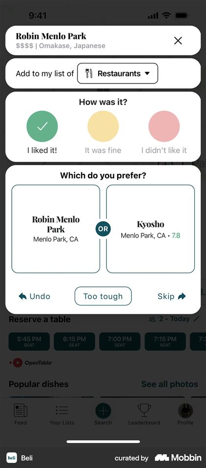

# Bingd — Screen Specification

**Version:** v2
**Status:** Draft for review
**Date:** 2026-08-15 (v1 was 2026-08-13)
**Specification:** [`../product/PRD.md`](../product/PRD.md) v0.6 · [`design-system.md`](./design-system.md) v2

What each screen is for, what is on it, and which states it must handle. Components and values come from [`design-system.md`](./design-system.md); this document does not restate them.

Where a screen has an unresolved choice, it is marked **Open** and repeated in §17.

> **What changed in v2.** The 0–10 score replaces the ordinal everywhere ([`design-system.md`](./design-system.md) §8), and the base surface is now Paper with Parchment as its warm accent (§1 there). Six screens were reworked against reference material on 2026-08-15: Collection §5, Title detail §6, Feed §7, Recommendations §8, Profile §9, Search §11. Reference archives are git-ignored under `design-references/`; screens cited by filename below are committed, resized, in [`references/`](./references/).

---

## 1. Inventory

| # | Screen | Section |
|---|---|---|
| 1 | Welcome and sign-in | §3 |
| 2 | Onboarding: name, username, photo | §3 |
| 3 | Onboarding: seed your taste | §3 |
| 4 | Onboarding: find and invite friends | §3 |
| 5 | Log sheet — bucket prompt | §4 |
| 6 | Comparison | §4 |
| 7 | Reveal | §4 |
| 8 | Collection | §5 |
| 9 | Title detail | §6 |
| 10 | Feed | §7 |
| 11 | Recommendations | §8 |
| 12 | Profile and match | §9 |
| 13 | Leaderboard | §9 |
| 14 | Lists | §10 |
| 15 | Search | §11 |
| 16 | Letterboxd import | §12 |
| 17 | Notification inbox and settings | §13 |
| 18 | Share sheet and cards | §14 |
| 19 | Settings, privacy, blocking | §15 |

---

## 2. Navigation — Decided 2026-08-13, superseding Provisional INF-4

[`client.md`](../architecture/client.md) §2 proposed **Feed · Search · + · Recommendations · Profile**, with rankings and lists inside Profile, and flagged it as expected to change during design. It changed, for two reasons.

**The collection is buried.** Both reference apps give the user's own collection a top-level tab and neither hides it behind a profile. Letterboxd's first tab is the user's own films; Beli's second is "Your Lists." A ranking is the thing a Bingd user returns to daily and the artifact the whole product produces, and reaching it through Profile puts the user's private working surface behind their public identity page.

**Search does not need a tab of its own.** In Beli the center button *is* search, because searching for a place is how you log one. The same is true here: you search for a film in order to log it, so the center **+** and the search field are the same action. Keeping both spends a tab slot on a duplicate entry point.

**Decided:**

| Tab | Contents |
|---|---|
| **Feed** | Followed users' activity |
| **Collection** | Watched, Watchlist, Unranked, Lists — §5, reworked 2026-08-15 |
| **+** | Log and rank — opens directly into title search |
| **Recommendations** | The generated slate |
| **Profile** | Public identity, stats, match, leaderboard, settings |

Search for **people** lives in Profile and in the invite flow; search for **titles** lives behind **+** and as a header affordance on Feed and Collection. Leaderboard sits inside Profile because it is a statement about standing among friends, which is identity rather than a daily surface.

Confirmed by the founder on 2026-08-13. Recorded in [`../product/decision-log.md`](../product/decision-log.md) §12.

---

## 3. Onboarding

Four steps. Each is skippable except account creation, and each states why it is asking.

**Welcome and sign-in.** Wordmark on Parchment, one line of positioning, three buttons: Continue with Apple, Continue with Google, Continue with email. Apple is required on iOS (PRD §7). The email path is a one-time code, never a password — no user ever creates or manages one, which removes a whole category of screen and a whole category of support request. One exception, and it is deliberately quiet: a *More sign-in options → Sign in with password* line below the three buttons, leading to a separate screen for the App Store / Play review account, which cannot receive an emailed code. It is `tertiary`, `sm`, secondary-toned, and offers no way to create an account — see [`../release/store-review-access.md`](../release/store-review-access.md).

**Name, username, photo.** One field per screen. Username availability resolves live with the taken state written plainly rather than as a red error. Photo is genuinely optional and the skip is a visible button, not a small link.

**Seed your taste.** The cold-start problem: recommendations and match need ranked titles, and a new user has none. Two entry points, presented together.

- **Import from Letterboxd** — the fastest path, and the reason import is in v1 (§12).
- **"Which of these have you seen?"** — a grid of widely-seen titles. Tapping one logs it. This is Beli's "How many of these spots have you tried?" ([`references/beli-30-collection-progress.jpg`](./references/beli-30-collection-progress.jpg)) and it works because recognition is far easier than recall.

Beli also asks what you dislike during onboarding ([`references/beli-20-onboarding-dislikes.jpg`](./references/beli-20-onboarding-dislikes.jpg)). Bingd should not. Genre exclusions collected before a user has logged anything are guesses about themselves, they conflict with the guardrails in [`recommendations.md`](../architecture/recommendations.md), and the same signal arrives more honestly from the *I didn’t like it* bucket.

**Find and invite friends.** Contact matching is opt-in with an explicit explanation of what leaves the device. Below it, the personal invite link with a native share action. Skippable.

The user lands on an empty Collection with one clear next action, never on an empty Feed.

---

## 4. The log and rank loop

The core of the product. Three surfaces in sequence, and the sequence must feel like one continuous motion.

### Log sheet — bucket prompt

Opened from **+**, from a title page, or from a search result. A sheet, not a screen, so the context underneath stays visible — this is what makes Beli's version feel light ([`references/beli-224-bucket-prompt.jpg`](./references/beli-224-bucket-prompt.jpg)).

Anatomy: title header with poster and a close control; a category indicator (Movies or TV seasons); **"How was it?"** with the three bucket chips; then optional rows for who you watched it with, a note — one **Note** row since 2026-08-27, private until its *Share as a review* chip publishes it (PRD §22) — and the date.

**Built 2026-08-14 without two of those rows.** The tagging picker needs the social graph, which does not exist yet. The date row is not built either, and the consequence is worth stating plainly: the watch date is written only alongside a note, so a user cannot record "I watched this last night" without also typing something. Recorded in [`open-questions.md`](../product/open-questions.md). *Both were built later; the date row's own behaviour is below.*

**The watch date, and forgetting it (2026-08-24).** The row offers Today, Yesterday, a month grid, and **"Don't remember"**. Choosing a bucket stamps today the first time, and it must — the row displays "Today" as a pending default, and a default the sheet never saved is a claim it cannot keep. What was missing was the way back: `log_watched` coalesces its date, so nothing in the app could say "I watched this, I just don't know when", and the founder had to leave the flow and edit the title afterwards, which does not work either for the same reason.

**Clearing the date does not un-log the title.** The bucket is an independent watch signal, so the title stays Logged with `watched_on = null`; the server enforces that rather than merely allowing it, refusing the one case where the date is the only record of the watch (api.md §1). The label is **"Don't remember"** and not "Clear date": clear is what the control does to the field, not what the person means, and it reads as undoing the log. The row then reads **"Not recorded"** rather than "Today", and the bucket stamp is suppressed so the next rating tap cannot silently write the date back.

Two rules the architecture depends on:

- Choosing a bucket **saves immediately** and is queueable offline. The title is now Logged.
- Comparisons start only when the user taps **"Find where it lands."** Bucketing and ranking are separate actions ([`api.md`](../architecture/api.md) §1), and this is the surface where that separation becomes visible to the user.

Offline, the bucket saves with a pending marker and the ranking action is disabled with its reason shown.

**Tagging** sits here: "Who did you watch it with?" opens a picker of people you follow or who follow you, up to ten. A non-user can be invited from the same picker, which is the hand-off in PRD §17.

### Comparison



Beli's version is a stacked card inside the same sheet, with Undo, "Too tough," and Skip along the bottom. The structure is right and Bingd should follow it: staying in the sheet preserves the sense that bucketing and comparing are one flow.

Bingd's version is barer. Two `poster.xl` cards, **"Which did you like more?"** above them in `title2`, the film's title beneath each card, and the controls below. No year, no runtime, no genre. Everything else is something the user reads instead of deciding.

**Two controls, not three (built 2026-08-14).** This section previously specified three, mapping to `rank_back`, `rank_skip` and `rank_skip`. Beli's "Too tough" and Skip call the same thing, so Bingd ships one control for both: two buttons that do the same work is a choice the user has to think about for no reason.

**Undo and Skip (renamed 2026-08-24).** The two were **Back** and **Too tough to call**, and both words were checked against what the server does rather than kept.

`rank_back` restores `lo`, `hi` and `pivot` from the history entry it pops, and decrements the skip count (20260813001600). It genuinely reverses the previous answer, so **Undo** is the accurate word and **Back** was the weaker one — and on a screen with no navigation stack, "Back" also invited the reading "leave this sheet", which is the close control in the corner. At the first comparison there is nothing to reverse and the server ends the session instead; the title keeps its bucket and stays Logged, which is the same promise kept.

**Skip** replaces **Too tough to call** because that wording named only half of what `rank_skip` is for. The founder's case is the other half: the poster is familiar and the memory is not, and "too tough to call" is the wrong sentence for "I do not remember this one well enough to say". Both want a different opponent and both always got one — the mechanism is unchanged and the word is the fix. It is also the shortest label in a row that has to fit under two posters on a 375pt screen. Its accessibility label is "Skip this comparison", because "Skip" alone could be heard as skipping the whole ranking, which is a different act with a different control.

Both are `sm` and secondary-toned since the same date. At `md` they were 48pt tall, `headline` weight and full ink — physically the control the app uses for the primary act of a screen, sitting directly under the two posters that *are* the act, so they read as the question rather than as the way out of it.

**No progress line at all (2026-08-24).** This section previously specified a quiet line rather than a bar, on the grounds that the remaining count is an estimate from a range only the server knows. That reasoning was right and it argued one step further than the section took it: an estimate this screen cannot make is not information, and "A few comparisons to go" followed by "Getting closer" is encouragement. Founder feedback called it distracting and non-actionable, and it was also a line that changed on every comparison beside two posters somebody is trying to compare.

What survives is the one message that is not encouragement: after a skip the pair changes, and **"Try this one instead"** says why. Without it a poster silently becoming a different poster reads as a fault. The slot keeps its height when the sentence is absent, so the controls below do not move between comparisons.

**Long press to remember a title (2026-08-24).** Founder request: a poster and a name are enough to recognise a film and not always enough to *remember* it, and the only way out of that was to abandon the ranking and look the title up — which loses the session and every answer already given.

Pressing and holding either poster opens a compact sheet inside the comparison: the full name, the year, certification, length, genres, who directed or created it, the top cast and the overview, scrollable if it runs long. Nothing to act on — no score, no watchlist control, no reviews — because an action here would be a second decision competing with the one the reader is in the middle of. Dismissing returns to the same pair, because the reminder renders *inside* the comparison and nothing about the pair was ever unmounted.

React Native suppresses `onPress` after a long press, so holding a poster to read about it cannot also register as choosing it — the correctness property this gesture needed. A long press is invisible and unreachable to a screen reader, so each card also carries a small **"What is this?"** control with its own label, per design-system.md §8's rule that a hidden gesture may be the fast path and never the only one.

It adds no new data path: the row comes from `media_items`, which the comparison card already reads, and the credits from the `credits` facet of `media_cache`, which the title page has read since the integration landed. Nothing is fetched until somebody actually asks.

**No prefetch, and none is possible (corrected 2026-08-14).** This section previously claimed the next pivot's poster prefetches while the user decides. It cannot: the next pivot's identity is chosen by `rank_answer` from the answer being given, so it does not exist until the round trip returns. What is built instead is that neither card can be tapped until the opponent is on screen — answering against a card showing an ellipsis records a preference over something the user was never shown. A stall here still damages the mechanic, and the honest fix is the server round trip, not a prefetch.

**The comparison card never shows the opponent's score.** Beli shows it (`7.8` in the reference) and Bingd deliberately does not. "This is my 9.2" is an anchor that invites agreement rather than a real judgment, and the mechanic's whole value is unanchored preference. The score is visible everywhere else in the app, which makes this the one screen where keeping it off has to be deliberate. Decided by the founder on 2026-08-13; unchanged by the move to scores on 2026-08-15, and more important now that the badge appears on every other surface.

### Reveal

The composition in [`design-system.md`](./design-system.md) §9: an Amber panel, the **score** in Ink at display size, title and bucket below. The score counts up from the low end of its own band rather than from zero, so the animation reads as placing the title inside the bucket the user just chose.

Below the panel, three actions: **Share**, **Rank another**, and **Done**. **Share is absent as built (2026-08-14)** — share cards do not exist, and an action that does nothing is worse than one that has not arrived. Beli celebrates the first rank specifically ([`references/beli-229-first-rank-celebration.jpg`](./references/beli-229-first-rank-celebration.jpg)) and Bingd should too — the first reveal is the moment the product explains itself, and it is worth a distinct line of copy.

---

## 5. Collection — reworked 2026-08-15

The user's own working surface.

### Ranked and Watched were the same list

v1 had four segments: **Ranked · Logged · Watchlist · Lists**. As built, Ranked and Watched showed largely the same titles in a different order, because almost everything a user logs they also rank. Two tabs that mostly agree force a choice with no meaning behind it, and the user has to learn which one is the "real" list.

**Decided: one list.** The segments are **Watched · Watchlist · Unranked**, and Unranked appears only when the count is non-zero — a tab that is always empty for most users is a permanent reminder of a chore.

Watched is sorted by score descending, which *is* position order, so it reproduces v1's Ranked tab exactly while also containing the unranked titles. A ranked title shows its score; an unranked one shows the dashed `Rank` badge, which is a button into the ranking sheet. The list is therefore complete and honest at the same time, and the fastest path to ranking something is now sitting in the list the user already looks at.

Unranked survives as a tab because it is a useful *filter* of that list, not a different list.

### Header

Beli's stacked header ([`references/beli-60-list-header.jpg`](./references/beli-60-list-header.jpg)): a category dropdown, then tabs, then utilities. Bingd's version, top to bottom:

```
bingd.                                    ⚙
Movies ˅                                        ← title1, DM Serif, opens a sheet
Watched      Watchlist      Unranked            ← active: Ink + Maroon underline
⇅ Score                                         ← sort
```

**Movies / TV becomes a dropdown**, replacing v1's tap-to-cycle toggle. A control that changes value on tap without saying what it will change to cannot be read before it is used, and with only two options it happened to work — it would have broken the moment a third category existed. A dropdown states the current value and shows the alternatives on demand.

### Rows

The compact row from [`design-system.md`](./design-system.md) §8, which is Letterboxd's diary row ([`references/letterboxd-55-diary.jpg`](./references/letterboxd-55-diary.jpg)): 38 × 57 poster, title and year, `148m · Action · Adventure`, score badge right.

**The band headers are gone.** *LOVED IT* / *IT WAS FINE* / *NOT FOR ME* section headers made the bucket partition legible when the only number on the row was an ordinal that said nothing about how much the user liked something. The score says it — the ranges do not overlap, and the badge is tinted by bucket — so the headers now caption information already present twice on every row.

**The bucket label is gone from the subtitle** for the same reason. `I liked it · 148m · Action` next to a badge reading `8.7` spends the most valuable line on the row restating the badge.

No progress bar toward 100% and no "380 remaining" (PRD §5). Someone importing 800 films must not open this tab and feel behind.

**Lists is still absent**, deliberately: there is no list UI yet, and an empty tab that cannot be filled is worse than one that has not arrived.

Beli puts a milestone tracker at the top of this surface — progress toward unlocking scores and recommendations ([`references/beli-30-collection-progress.jpg`](./references/beli-30-collection-progress.jpg)). Bingd should use this pattern **only** for the recommendation threshold, where the target is finite and reaching it unlocks something real. It must never appear over the ranked list itself, where there is no finish line.

---

## 6. Title detail — redesigned 2026-08-15

### What was wrong

v1 specified a poster at `poster.lg` with the title beside it and explicitly no backdrop, because §1 of the design system forbade full-bleed artwork on Parchment. As built it was the weakest screen in the app, and the reason is structural rather than cosmetic: a title page whose largest element is a 132pt poster on a tan field has no focal point, so it reads as a form rather than as a page about a film. Every app in the reference set — Letterboxd, Apple TV, Max — opens a title page with a wide image, and they do it because artwork is the only thing on the screen the user recognises instantly.

**Decided: this screen gets the app's one full-bleed hero** ([`design-system.md`](./design-system.md) §1, §7).

### Composition

The top half is Luma's event page, which solves a closely related problem — a hero image, an identity object overlapping it, then a dense block of state and metadata — and does it on a light background, which Letterboxd and Apple TV do not.

```
┌────────────────────────────────────────────┐
│                                            │
│   backdrop, 16:9, scrim to surface.base    │   ← the app's only full-bleed artwork
│                                            │
│                          ┌──────────────┐  │
└──────────────────────────│ Sci-fi │ Action│──┘  ← genre pills straddle the hero edge
   ┌──────────┐            └──────────────┘
   │          │   Inception
   │  poster  │   2010
   │  poster.lg│
   └──────────┘
   A thief who steals corporate secrets through dream-sharing
   technology is given the inverse task…              more
   148m · Christopher Nolan · Leonardo DiCaprio, Elliot Page

   ┌───────────────┐    ⬤        ↗
   │    Ranked     │   8.7     Share
   └───────────────┘
   Watched 12 Aug 2026

   ─────────────────────────────────────────────
   Cast    Details    Reviews    Seasons
```

**Genre pills straddle the hero's bottom edge.** This is the position Luma gives its "Highlight" chip, and it earns its place for a reason beyond decoration: genre is the single most useful fact about a film the user has not seen, and it is the thing they are scanning for when deciding whether to add it. Putting it half onto the artwork makes the hero and the content one object rather than a banner with a page beneath it. Pills use `surface.raised` with a hairline, not a bucket color — they are metadata, and §1 allows exactly one chromatic UI element on a content surface, which is spent on the score.

**Personal state sits above the fold, to the right of the primary action.** Rank/Ranked button, the watch date directly beneath it, then the score badge, then Share. Luma puts a map icon in that slot; the score is what belongs there in a collection app, because it is the answer to the question the user is asking when they open a film they have already seen.

The badge shows the dashed unranked state when the title is logged but not compared, which makes the two adjacent controls read as one sentence: *Rank* → *no score yet*. Nothing about that state is presented as a failure (PRD §26.4 AC 2).

**Order of the whole page:** the user's own state, then the primary action, then catalog metadata, then friend signal, then attribution. State comes first because this screen is most often opened by someone deciding whether they have already seen something.

### Tabs

Luma renders its secondary content as a scrolling row of pills. Bingd makes them real tabs — **Cast · Details · Reviews · Seasons** — because the content behind them is long and a user who wants the runtime should not scroll past the cast to find it. Apple TV's information layout ([`references/apple-tv-95-information.jpg`](./references/apple-tv-95-information.jpg)) is the model for Details: label above value, stacked, no table rules.

- **Cast** — the cast strip, plus director and writer.
- **Details** — released, runtime, genres, original language, and **the ordinal in full**: `#2 of 6 in Movies`, with the denominator, because a bare ordinal is unreadable without it (PRD §10).
- **Reviews** — the user's own note. Friends' notes when the feed carries them. Absent entirely until there is something in it; a tab that is always empty is worse than a missing tab.
- **Seasons** — series only. Per-season state, since the season is the rankable unit and the series is not (AD-1). This distinction is invisible in the data model and has to be made obvious here.

Tabs whose content does not exist for a given title are not rendered. A film has no Seasons tab.

### States

**No backdrop.** Common — the seed catalogue ships without artwork of any kind (PRD §7.14). The hero collapses to a short `surface.sunken` band at the height of the pill row, so the poster still overlaps something and the layout does not shift into a different design. Never a grey box where an image failed, and never a stretched poster standing in for a backdrop.

**No overview.** Omit the paragraph. Do not render a placeholder line.

**Provider attribution** appears here. TMDB's requirements are published and specific — an approved logo, kept less prominent than Bingd's own mark, plus the exact notice "This product uses the TMDB API but is not endorsed or certified by TMDB" in an About or Credits section. The notice itself lives in Settings; this screen carries the source line. Details in [`../reference/tmdb-integration.md`](../reference/tmdb-integration.md).

### As built — 2026-08-27: the hero is the backdrop's own shape, and Rank is the page's biggest thing

Two founder passes on a device, recorded together because both move the top of this screen.

**The hero frame is `status-bar inset + width ÷ (16:9)`.** The visible image box below the transparent header is exactly the backdrop's own 16:9 on every device, so the full artwork — top edge included — shows with no crop on either axis. The fixed frame ratios that preceded it (1.4, then 1.62, then 1.5) were each a different wrong crop on some device, because any frame that is not the image's own shape forces `cover` to choose an edge to lose. `POSTER_LIFT` went 96 → 120 and the heading gap halved (16 → 8), so the title starts sooner and the score cluster sits higher despite the deeper hero; the collapsed no-backdrop band tracks `POSTER_LIFT` at 120, so the two states keep one geometry.

**The personal cluster is the primary action of this page.** The reader's own score circle is the page's largest (`xl`, 64 — a badge size that exists for this cluster alone), the "Your score" caption is gone — a filled Maroon circle with a number in it, above a button named Rank, does not need a caption to say whose score it is — and Rank/Ranked is full 44pt control height with a `headline` label. **Recommend in the action row is outlined**: filled Maroon marks the primary action of the current context ([`design-system.md`](./design-system.md) §8), and on a title page that is this cluster. Recommend is filled again inside its own sheet, where sending is the point; Watchlist is unchanged; never two equally dominant Maroon CTAs in one view.

---

## 7. Feed — reworked 2026-08-15

Strictly chronological, no algorithmic ordering (PRD §14).

### Cards were the wrong container

As built, each activity was a bordered card on `surface.raised`. Three items produced three rounded rectangles stacked with gaps, and the chrome outweighed the content — a feed of cards reads as a list of notifications, not as a stream of things people did.

Beli's feed is flat: white ground, hairline between items, no card ([`references/beli-374-activity-item-full.jpg`](./references/beli-374-activity-item-full.jpg)). Letterboxd's is the same. **Decided: divider-separated rows, no card.** Removing the border also removes the double-surface problem, where a `surface.raised` card holds a poster that needs its own hairline to separate from it.

### What a movie feed has instead of photos

Beli's items are carried visually by food photography — a horizontal strip of square images per activity. That does not transfer, and the honest reason is that a movie app has no user photos to show. Every activity would carry the same official poster, and a wall of identical posters is not content.

**The poster does the work at a smaller size, and the score does the rest.** A compact title card inside the item is enough to identify the film; the score badge gives each row a distinct thing to look at, which is what the photo strip was actually providing. User photos — a shot of the group on movie night — are a plausible later addition and are out of scope for this pass.

### Anatomy

```
┌─────────────────────────────────────────────────┐
  (S)  Suraj ranked Inception with Anna
       ┌──┐
       │▓▓│  Inception (2010)                 ⬤ 8.7
       └──┘  148m · Sci-fi
       "Third time and it still holds up."
       ♡ 3    ↗    + Watchlist            13h ago
─────────────────────────────────────────────────
```

- **Avatar** `sm`, then the sentence. Actor name and title are Inter 600 inside a `body` sentence, which is Beli's bolded-entity treatment and makes the row scannable without a separate header line.
- **Tagged people render inline in the sentence** — "Suraj ranked *Inception* **with** Anna and Beth". This is Beli's pattern and it is the right home for Bingd's watch tagging: tagging reads as part of the story rather than as a metadata field.
- **The compact title card** — `poster.xs`, title and year, `148m · Sci-fi` — is a button to the title page.
- **The score badge** at `sm`, right-aligned against the title card. It replaces v1's rank badge.
- **The note**, if any, in `body`. Two lines then "more". The row renders one when given one; the feed does not yet pass one, because a note lives in `user_media` behind its author's RLS and nothing copies it into `feed_events.payload`. Publishing a user's own words to their followers' feeds is a moderation decision (`20260813000600` kept reactions text-free for exactly that reason), not something to slip in with a layout change.
- **The reaction row**: reactions, share, and **add to watchlist**. Beli surfaces "19 bookmarks" as social proof, and the Bingd equivalent — how many people added a title to their watchlist from this activity — is also the product's core virality metric (PRD §28), so it earns its place. Timestamp right-aligned on the same line.

**No comment affordance.** Comments are deferred (PRD §14) and a disabled comment icon would be worse than none.

### The actor must be named

An activity item whose subject is "Someone" is not an activity item. The interface must not absorb a missing actor behind a plausible-looking fallback, which is exactly what happened: every item read "Someone ranked a title." and looked enough like a deliberate anonymity feature to survive to a screenshot.

The cause was not the `profiles_read` policy, which admits your own row and every row you follow. `use-feed.ts` read the embedded profile as `row.profiles[0]`. PostgREST returns a to-one embed as an object and a to-many as an array, and its generated types claim array for both, so the index silently produced `undefined` and every fallback in the mapper fired at once — including on the user's own activity, where an unnamed actor is impossible by construction. `use-collection.ts` had already hit this and normalised with a small `media()` helper; the feed had not.

Where an actor genuinely cannot be resolved, the item is **omitted**. A feed with three items is honest; a feed with five items, two of them about nobody, is not.

Empty feed for a user following nobody: an invitation to find friends, not a spinner and not a blank page.

### The row as it stands — 2026-08-20

The anatomy above is the 2026-08-15 decision and is kept for its reasoning. Three device passes have moved the composition since, and this is where it landed:

```
┌─────────────────────────────────────────────────┐
  ┌──┐
  │▓▓│  Suraj ranked Inception (2010) with Anna   ⬤ 8.7
  │ (S)  148m · Sci-fi
  └──┘
        "Third time and it still holds up."
        ♡ 3   💬 2   🔖   ✈                  13h ago
─────────────────────────────────────────────────
```

- **One band, not three.** The avatar header line and the separate title card are gone; the sentence, the artwork and the score share a row, with the note and the actions hanging off it. That is what closed the density gap against Beli — three items filled a phone, and the difference was never type size.
- **One sentence.** Actor, verb, title, year, companions and any tail are a single wrapping text node. Actor and title are semibold and both are pressable; the year is muted and joined to the title by a non-breaking space, so a wrap cannot strand it.
- **One leading object.** The poster is the anchor and the actor's face is a small ringed chip in its bottom-right corner, contained inside the artwork rather than overhanging it. Two separate leading visuals is Bingd's problem and not Beli's — Beli has one photograph per item where Bingd has a poster *and* a face — and setting them side by side made the row read as busy.
- **One left text edge.** The sentence, the metadata, the note, the reaction cluster and the action icons all start at the poster's right edge. The metadata used to start 32pt left of the sentence it describes, because the avatar was standing in front of that sentence; nothing is offset by hand now.
- **Actions are icons**, labelled for screen readers and named after the title they act on. Comments shipped since — the icon appears only where a surface has wired the sheet up, and it carries a count and never a preview, since a preview is the mask that gets forgotten.

---

## 8. Recommendations — reworked 2026-08-15

Opens directly to a slate, never to a "generate" button — the slate is built on a schedule ([`recommendations.md`](../architecture/recommendations.md)).

### Shelves, not a single list

Max's home screen and Apple TV's ([`references/apple-tv-5-shelves.jpg`](./references/apple-tv-5-shelves.jpg)) are both stacks of titled horizontal shelves, and that structure fits recommendations better than a vertical list of cards for one reason: **the shelf title is where the explanation goes.** PRD §13 requires every recommendation to carry a reason derived from stored signals, and a reason that covers six titles at once — "Because you loved Inception" — costs one line instead of six.

Each shelf: a section header carrying the reason, then `poster.md` artwork with the last card clipped ([`design-system.md`](./design-system.md) §8). Tapping a poster opens the title page; the actions — add to watchlist, log it, dismiss with a reason — live there rather than on the tile, because a poster wall with three buttons per tile is not a poster wall.

Shelf titles are rendered from stored evidence and never composed on the client (AD-8). A shelf that cannot state its reason does not ship.

**One shelf gets the detailed treatment**: the top slate keeps v1's card form — `poster.lg`, title, and the full sentence, "Because you ranked *Sinners* #2 and Jordan ranked this #1" — because the first recommendation should show its work. The shelves beneath it are for browsing.

Before the threshold is reached, the tab shows what is missing and the fastest way to get there, which is the one place the milestone tracker from §5 belongs.

---

## 9. Profile, match, leaderboard

**Profile** is the public artifact: avatar, name, username, one stats block (PRD §5 permits exactly one), the top of the ranking, and lists. Viewing someone else's profile shows the match score with its evidence count — `88% match · 126 shared` — and the shared-titles view is the interesting screen, because agreement is more legible as a list of specific films than as a number.

**Top ranked is a poster wall, not rows** (2026-08-15). Three across, artwork only, each with its score chipped onto the corner ([`design-system.md`](./design-system.md) §8). Rows were the wrong form here: this is the one block on the profile that exists to be looked at rather than worked through, and three compact rows carrying runtime and genre give a visitor metadata they did not ask for while making the films themselves small. The wall is low-detail on purpose and every tile is a button.

**The avatar is uploadable.** It was not, and a profile with a permanent set of initials where a photo belongs undercuts the whole surface — this is the screen the product asks people to share. `profiles.avatar_url` had existed since the first identity migration and no code path could write it.

The control lives in **Settings**, not on the profile, because the profile is what other people see and changing your picture is an edit. Settings is also the only place it can live: `set_avatar` refuses a caller with no profile row, which keeps an avatar from existing during onboarding — where a storage object referencing `auth.users` would block the age gate's account deletion ([`20260813002200`](../../supabase/migrations/20260813002200_signup.sql) warned about exactly this).

The picker crops square at the source, since every surface renders the avatar in a circle, and the client downscales to 512px before upload. Each upload writes a **new filename** and deletes the previous one — overwriting at a stable path leaves the CDN and every already-rendered image serving the old face, which reads as the upload having silently failed.

**The stats block counts what it says.** `Watchlist` read `top.length`, the length of the top-six ranked slice, so an account with six rankings and an empty watchlist reported six.

**Recent activity uses the feed item from §7**, including its rule that an item with no resolvable actor is omitted rather than rendered as "Someone". On one's own profile every actor is oneself, so an unnamed item here is unambiguously a bug — and it was one, on every row, until 2026-08-15.

It is also **filtered to the profile's owner**. The underlying query spans everyone the user follows, and a friend's ranking under a heading on your own profile is a different claim from the one the heading makes.

Low-confidence matches are visually downweighted per PRD §13. A `94% match · 8 shared` must not look more impressive than `88% match · 126 shared`, which is exactly what a bare percentage would do.

**Leaderboard** ([`references/beli-405-leaderboard.jpg`](./references/beli-405-leaderboard.jpg)) ranks friends by activity within a scope. It is a social surface and it needs a deliberate tone: the Curious Collector voice, not a competitive one. Blocked users never appear, which follows automatically from `can_view_profile` (AD-5).

---

## 10. Lists

Create, title, describe, set visibility, add titles, reorder. A list detail page is a poster grid with a header.

Two behaviors carry product weight:

**Imported lists never count toward the limit** ([`api.md`](../architecture/api.md) §4). A user importing twelve Letterboxd lists keeps all twelve and can still create three of their own. The interface should not present the imported ones as an overage.

**Over the limit, nothing is lost.** Existing lists stay fully readable and editable; only creation is refused, with an explanation. This is the universal over-limit rule (PRD §20) and this is the screen where a user would first meet it.

---

## 11. Search — reworked 2026-08-15

One field, results as compact rows (§5), each with a log action. Fast enough that it feels like filtering rather than querying.

The **+** tab opens here with the field focused. A separate people-search lives in Profile and in the invite flow.

### The idle state is not empty

An autofocused field over a blank screen is the most common state of this tab and v1 gave it a single line of prompt copy. **Recent searches** fill it instead: a section header, the last several queries as tappable rows, and a way to clear them. This is Spotify's library pattern and it is worth having because film search is genuinely repetitive — people look for the same title across several sessions before they watch it.

### Filters

A row of filter pills beneath the field: **All · Movies · TV**. The underlying RPC already restricts results to films and series, so this is a client-side narrowing of what came back and costs nothing.

Deeper filters — year, decade, genre — are **Open** (§17). They need a server change and there is no evidence yet that a catalogue this size needs them.

### Matching must survive punctuation

"Spiderman" returning nothing while "Spider-Man" exists in the catalogue is the kind of failure that makes a user conclude the app has a small library. Titles are full of punctuation the user will not type: hyphens, colons, ampersands, apostrophes. Search must match across it in both directions — typing the punctuation when the title has none, and omitting it when the title has some.

This is a server concern and the fix is in [`../architecture/api.md`](../architecture/api.md); the design requirement is only that **no result set is empty because of a character the user cannot be expected to guess.**

### An empty screen has several meanings

Search answers from two places — the local catalogue, then TMDB when the local answer was thin — and a blank list can mean five different things. Each gets its own copy, because the action they call for differs:

| State | What it says | Action |
| --- | --- | --- |
| Still asking TMDB | Looking further afield… | none, it is in progress |
| Both searched, nothing found | Nothing matches that | check the spelling |
| Rate limited | Too many searches | wait |
| TMDB errored | Could not search wider | Try again |
| Filter hid every row | Nothing in this filter | switch to All |

The fourth is the one worth naming. A failed wider lookup used to render as "nothing matches" — the app stating confidently that a film does not exist when what actually happened is that it never managed to ask. A missing provider key looked identical to an empty catalogue, which is how that failure stayed invisible.

Beli's "Import your lists" entry point sits inside its list surface ([`references/beli-66-import-lists.jpg`](./references/beli-66-import-lists.jpg)); Bingd's equivalent belongs in Collection and in onboarding, not in search.

---

## 12. Letterboxd import

Four steps, each of which can be left and resumed.

**Upload.** Plain instructions for exporting from Letterboxd, then a file picker.

**Review.** The counts, stated plainly: how many titles matched, how many did not, how many lists came across. Unmatched titles are listed and resolvable by hand, and skipping them is fine.

**Mapping.** Star ratings map to buckets automatically with no user interface, per the founder's confirmation of INF-1. The mapping is stated once, plainly, and every bucket stays editable afterward. Ratings never produce positions — imported titles arrive **Logged, not Ranked**, which is the safety property the two-table split exists to guarantee ([`data-model.md`](../architecture/data-model.md)).

**Anchors.** A short guided session — roughly ten to fifteen comparisons over titles the user rated most highly — that produces a real ranking spine without asking anyone to rank 800 films. This is the step that turns an import into a usable collection, and it is where an import either succeeds or quietly ends.

Afterward, unranked titles surface as the occasional nudge described in PRD §15, never as a backlog.

---

## 13. Notifications

Beli's settings screen is the best available baseline for scope ([`references/beli-446-notification-settings.jpg`](./references/beli-446-notification-settings.jpg)) — twelve toggles covering follows, saves from your list, likes, comments, contacts joining, featured lists, news, weekly rank reminders, and streaks.

Bingd's v1 set is deliberately smaller, matching PRD §15: someone followed you, someone reacted to your activity, someone tagged you in a watch, someone you invited joined, someone added a title to their watchlist from your activity, and the twice-weekly ranking nudge.

Beli's streak reminders are **not** adopted. Streaks manufacture obligation, and the product's position is a collection you keep, not a habit you maintain.

**Inbox** is a chronological list, grouped by day, with unread state. **Settings** is one toggle per category, matching the per-category preferences in [`data-model.md`](../architecture/data-model.md). Push delivery is flagged off server-side in v1 (AD-10), so the settings screen exists and works from day one against the inbox alone.

---

## 14. Sharing

The **Top 10 share card** is the polished artifact (PRD §16): ten posters, scores, and titles on Parchment, set in DM Serif Display, with the wordmark. Parchment stays the share-card ground even though the app moved to Paper — a shared image has no surrounding interface to sit inside, so the warmth has to come from the card itself, and Parchment is what makes it recognisably Bingd in someone else's feed. Poster-forward, because artwork is what makes a shared image stop someone mid-scroll, and typographic enough that the card is recognizably Bingd rather than a generic grid.

**Two canvases**, designed separately rather than one scaled:

| Format | Layout |
|---|---|
| **Feed card**, 4:5 | Two columns of five. Score and title beside each poster |
| **Story card**, 9:16 | Content confined to the middle 80% vertically, clear of platform chrome. Wordmark at the top of the safe area, ten items below |

The story card matters most, because Stories is where this kind of image actually gets posted. Its trap is vertical safe area: every platform overlays a reply bar and a header, and a tenth title hidden underneath makes the card look broken.

Each must render with ten titles, with fewer than ten, and with **artwork partly or wholly missing** — common after a Letterboxd import reaching obscure titles. Missing posters use the designed placeholder, and an all-text layout covers a top 10 that is mostly unillustrated.

Sharing uses the OS share sheet, so the user picks Instagram Stories or TikTok themselves. Direct-to-Stories buttons are a later addition, and the native declarations that make that addition cheap ship in the first build (PRD §16).

Secondary cards: a single ranking reveal, and a profile match card.

Every share routes through the native share sheet. Link previews are server-rendered, which is the one place artwork appears outside the app and therefore the first place a licensing restriction would bite.

---

## 15. Settings, privacy, blocking

Conventional grouped list. Three parts carry product weight.

**Privacy** is where a profile becomes private. Changing it takes effect immediately, including on already-shared links, because a share token is never authorization (AD-8) — and the screen should say so in one plain line rather than leaving the user to guess whether old links still work.

**Blocked accounts** lists blocks with an unblock action, and states plainly that unblocking does not restore a previous follow ([`api.md`](../architecture/api.md) §3).

**Account deletion** is reachable, not buried, and states what is deleted and what is retained.

---

## 16. Not designed here

Deliberately out of scope for v1, listed so their absence is not read as an oversight: any billing, paywall, price, or "Pro" surface (PRD §20); comment threads (PRD §14); a Midnight dark theme (PRD §5); episode-level anything (PRD §10); web app screens beyond the share and invite landing pages.

---

## 17. Open

Nothing here is blocking. The questions that were — the tab structure in §2 and the comparison card in §4 — were resolved by the founder on 2026-08-13; the score display and base surface were resolved on 2026-08-15.

| # | Question | Working answer |
|---|---|---|
| 1 | Illustration style for empty states and onboarding | Choose a source before the first build |
| 2 | Ranking nudge copy and timing — PRD §15 | Draft alongside notification implementation |
| 3 | Deeper search filters: year, decade, genre — §11 | Not built. Needs a server change, and no evidence yet that a catalogue this size needs them |
| 4 | Sort options on Collection beyond score — §5 | Score descending is the only sort. Recently watched and A–Z are cheap to add once asked for |
| 5 | User photos on feed items — §7 | Out of scope. Revisit if watch tagging shows people want to post movie-night pictures |
