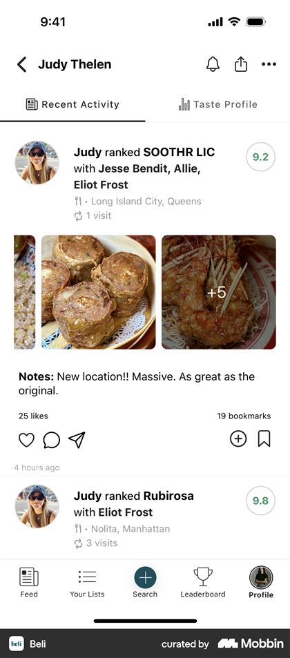

# Bingd — Screen Specification

**Version:** v1 (public alpha)
**Status:** Draft for review
**Date:** 2026-08-13
**Specification:** [`../product/PRD.md`](../product/PRD.md) v0.6 · [`design-system.md`](./design-system.md)

What each screen is for, what is on it, and which states it must handle. Components and values come from [`design-system.md`](./design-system.md); this document does not restate them.

Where a screen has an unresolved choice, it is marked **Open** and repeated in §17.

---

## 1. Inventory

| # | Screen | Section |
|---|---|---|
| 1 | Welcome and sign-in | §3 |
| 2 | Onboarding: name, username, photo | §3 |
| 3 | Onboarding: seed your taste | §3 |
| 4 | Onboarding: find and invite friends | §3 |
| 5 | Log sheet — bucket prompt | §4 |
| 6 | Comparison | §4 |
| 7 | Reveal | §4 |
| 8 | Collection | §5 |
| 9 | Title detail | §6 |
| 10 | Feed | §7 |
| 11 | Recommendations | §8 |
| 12 | Profile and match | §9 |
| 13 | Leaderboard | §9 |
| 14 | Lists | §10 |
| 15 | Search | §11 |
| 16 | Letterboxd import | §12 |
| 17 | Notification inbox and settings | §13 |
| 18 | Share sheet and cards | §14 |
| 19 | Settings, privacy, blocking | §15 |

---

## 2. Navigation — supersedes Provisional INF-4

[`client.md`](../architecture/client.md) §2 proposed **Feed · Search · + · Recommendations · Profile**, with rankings and lists inside Profile, and flagged it as expected to change during design. It should change, for two reasons.

**The collection is buried.** Both reference apps give the user's own collection a top-level tab and neither hides it behind a profile. Letterboxd's first tab is the user's own films; Beli's second is "Your Lists." A ranking is the thing a Bingd user returns to daily and the artifact the whole product produces, and reaching it through Profile puts the user's private working surface behind their public identity page.

**Search does not need a tab of its own.** In Beli the center button *is* search, because searching for a place is how you log one. The same is true here: you search for a film in order to log it, so the center **+** and the search field are the same action. Keeping both spends a tab slot on a duplicate entry point.

**Recommended:**

| Tab | Contents |
|---|---|
| **Feed** | Followed users' activity |
| **Collection** | Ranked, Logged, Watchlist, Lists |
| **+** | Log and rank — opens directly into title search |
| **Recommendations** | The generated slate |
| **Profile** | Public identity, stats, match, leaderboard, settings |

Search for **people** lives in Profile and in the invite flow; search for **titles** lives behind **+** and as a header affordance on Feed and Collection. Leaderboard sits inside Profile because it is a statement about standing among friends, which is identity rather than a daily surface.

**Open — founder confirmation.** This replaces a Provisional decision, so it needs a yes rather than silence.

---

## 3. Onboarding

Four steps. Each is skippable except account creation, and each states why it is asking.

**Welcome and sign-in.** Wordmark on Parchment, one line of positioning, three buttons: Continue with Apple, Continue with Google, Continue with email. Apple is required on iOS (PRD §7). The email path is a one-time code, never a password — no password field exists anywhere in the app, which removes a whole category of screen and a whole category of support request.

**Name, username, photo.** One field per screen. Username availability resolves live with the taken state written plainly rather than as a red error. Photo is genuinely optional and the skip is a visible button, not a small link.

**Seed your taste.** The cold-start problem: recommendations and match need ranked titles, and a new user has none. Two entry points, presented together.

- **Import from Letterboxd** — the fastest path, and the reason import is in v1 (§12).
- **"Which of these have you seen?"** — a grid of widely-seen titles. Tapping one logs it. This is Beli's "How many of these spots have you tried?" ([`references/beli-30-collection-progress.jpg`](./references/beli-30-collection-progress.jpg)) and it works because recognition is far easier than recall.

Beli also asks what you dislike during onboarding ([`references/beli-20-onboarding-dislikes.jpg`](./references/beli-20-onboarding-dislikes.jpg)). Bingd should not. Genre exclusions collected before a user has logged anything are guesses about themselves, they conflict with the guardrails in [`recommendations.md`](../architecture/recommendations.md), and the same signal arrives more honestly from the *Not for me* bucket.

**Find and invite friends.** Contact matching is opt-in with an explicit explanation of what leaves the device. Below it, the personal invite link with a native share action. Skippable.

The user lands on an empty Collection with one clear next action, never on an empty Feed.

---

## 4. The log and rank loop

The core of the product. Three surfaces in sequence, and the sequence must feel like one continuous motion.

### Log sheet — bucket prompt

Opened from **+**, from a title page, or from a search result. A sheet, not a screen, so the context underneath stays visible — this is what makes Beli's version feel light ([`references/beli-224-bucket-prompt.jpg`](./references/beli-224-bucket-prompt.jpg)).

Anatomy: title header with poster and a close control; a category indicator (Movies or TV seasons); **"How was it?"** with the three bucket chips; then optional rows for who you watched it with, a private note, and the date.

Two rules the architecture depends on:

- Choosing a bucket **saves immediately** and is queueable offline. The title is now Logged.
- Comparisons start only when the user taps **"Find where it lands."** Bucketing and ranking are separate actions ([`api.md`](../architecture/api.md) §1), and this is the surface where that separation becomes visible to the user.

Offline, the bucket saves with a pending marker and the ranking action is disabled with its reason shown.

**Tagging** sits here: "Who did you watch it with?" opens a picker of people you follow or who follow you, up to ten. A non-user can be invited from the same picker, which is the hand-off in PRD §17.

### Comparison

Beli's version is a stacked card inside the same sheet, with Undo, "Too tough," and Skip along the bottom. The structure is right and Bingd should follow it: staying in the sheet preserves the sense that bucketing and comparing are one flow, and the three controls map exactly to the API — `rank_back`, `rank_skip`, `rank_skip` ([`ranking.md`](../architecture/ranking.md)).

Bingd's version is barer. Two `poster.xl` cards, **"Which did you like more?"** above them in `title2`, the film's title beneath each card, and the three controls below. No year, no runtime, no genre. Everything else is something the user reads instead of deciding.

Progress is shown as a quiet line — "About 3 more" — rather than a bar, because the count is an estimate from the binary search and a bar implies precision the algorithm does not have.

The next pivot's poster prefetches while the user decides ([`client.md`](../architecture/client.md) §5). A stall here damages the whole mechanic.

**Open — does the comparison card show the opponent's current rank?** Beli shows the opponent's score (`7.8` in the reference). The Bingd equivalent is its ordinal. Showing it gives useful context; hiding it keeps the judgment clean, since "this is my #2" is an anchor that invites agreement rather than a real comparison. **Recommendation: hide it.** The mechanic's value comes from unanchored preference, and the position is visible everywhere else in the app.

### Reveal

The composition in [`design-system.md`](./design-system.md) §9: an Amber panel, the ordinal in Ink at display size, category and title below.

Below the panel, three actions: **Share**, **Rank another**, and **Done**. Beli celebrates the first rank specifically ([`references/beli-229-first-rank-celebration.jpg`](./references/beli-229-first-rank-celebration.jpg)) and Bingd should too — the first reveal is the moment the product explains itself, and it is worth a distinct line of copy.

---

## 5. Collection

The user's own working surface. Four segments: **Ranked · Logged · Watchlist · Lists**.

**Ranked** is the artifact. Titles in position order, grouped under band headers — *Loved it*, *It was fine*, *Not for me* — which is how the bucket partition (INF-3, now decided) becomes legible rather than mysterious. Each row is a title row with its ordinal. A category switcher toggles Movies and TV seasons, which are separate rankings.

**Logged** holds watched titles without a position. Its header states the split plainly — "142 ranked · 380 logged" — which is the PRD §5 wording, and offers **"Rank a few"** to start a session over unranked titles. No progress bar toward 100% and no "380 remaining," per the same guidance. Someone importing 800 films must not open this tab and feel behind.

**Watchlist** is a simple list with the fastest possible path to logging.

**Lists** shows the user's lists with the three-list limit expressed as a plain statement of what exists, not as a meter counting toward a wall.

Beli puts a milestone tracker at the top of this surface — progress toward unlocking scores and recommendations ([`references/beli-30-collection-progress.jpg`](./references/beli-30-collection-progress.jpg)). Bingd should use this pattern **only** for the recommendation threshold, where the target is finite and reaching it unlocks something real. It must never appear over the ranked list itself, where there is no finish line.

---

## 6. Title detail

Poster at `poster.lg` with the title in `title2` beside it — not a full-bleed backdrop ([`design-system.md`](./design-system.md) §1). Letterboxd's dark treatment ([`references/letterboxd-34-title-detail.jpg`](./references/letterboxd-34-title-detail.jpg)) does not transfer to Parchment.

Order: the user's own state first (bucket, rank, note, watch date), then the primary action, then friend signal — who among the people you follow has ranked it and where — then catalog metadata, then attribution.

The user's own state comes first because this screen is most often opened by someone deciding whether they have already seen something.

**Provider attribution** appears here in whatever form HG-1 requires. Its placement is a layout slot now so that a licensing requirement later is a content change rather than a redesign.

For a series, seasons are listed with per-season state, since the season is the rankable unit and the series is not (AD-1). This distinction is invisible in the data model and has to be made obvious here.

---

## 7. Feed

Strictly chronological, no algorithmic ordering (PRD §14).

Beli's item structure adapts almost directly, with tagged people rendered inline in the sentence — "Judy ranked SOOTHR LIC **with** Jesse Bendit, Allie, Eliot Frost." That inline treatment is the right home for Bingd's watch tagging: it makes tagging feel like part of the story rather than a metadata field.

A Bingd item: avatar, then the sentence — **"Alex ranked *Sinners* with Jerry and Beth"** — then the rank badge, then the poster, then the note if any, then the reaction row and timestamp.

The rank badge replaces Beli's score. `#3 in Movies`, never a number out of ten.

The reaction row is reactions, share, and **add to watchlist**. Beli surfaces "19 bookmarks" as social proof, and the Bingd equivalent — how many people added a title to their watchlist from this activity — is also the product's core virality metric (PRD §28), so it earns its place.

**No comment affordance.** Comments are deferred (PRD §14) and a disabled comment icon would be worse than none.

Empty feed for a user following nobody: an invitation to find friends, not a spinner and not a blank page.

---

## 8. Recommendations

Opens directly to a slate, never to a "generate" button — the slate is built on a schedule ([`recommendations.md`](../architecture/recommendations.md)).

Each card: `poster.lg`, title, and **the reason, stated in one plain sentence** — "Because you ranked *Sinners* #2 and Jordan ranked this #1." The reason is rendered from stored evidence and never composed on the client (AD-8). Actions: add to watchlist, log it, or dismiss with a reason.

Before the threshold is reached, the tab shows what is missing and the fastest way to get there, which is the one place the milestone tracker from §5 belongs.

---

## 9. Profile, match, leaderboard

**Profile** is the public artifact: avatar, name, username, one stats block (PRD §5 permits exactly one), the top of the ranking, and lists. Viewing someone else's profile shows the match score with its evidence count — `88% match · 126 shared` — and the shared-titles view is the interesting screen, because agreement is more legible as a list of specific films than as a number.

Low-confidence matches are visually downweighted per PRD §13. A `94% match · 8 shared` must not look more impressive than `88% match · 126 shared`, which is exactly what a bare percentage would do.

**Leaderboard** ([`references/beli-405-leaderboard.jpg`](./references/beli-405-leaderboard.jpg)) ranks friends by activity within a scope. It is a social surface and it needs a deliberate tone: the Curious Collector voice, not a competitive one. Blocked users never appear, which follows automatically from `can_view_profile` (AD-5).

---

## 10. Lists

Create, title, describe, set visibility, add titles, reorder. A list detail page is a poster grid with a header.

Two behaviors carry product weight:

**Imported lists never count toward the limit** ([`api.md`](../architecture/api.md) §4). A user importing twelve Letterboxd lists keeps all twelve and can still create three of their own. The interface should not present the imported ones as an overage.

**Over the limit, nothing is lost.** Existing lists stay fully readable and editable; only creation is refused, with an explanation. This is the universal over-limit rule (PRD §20) and this is the screen where a user would first meet it.

---

## 11. Search

One field, results as title rows, each with a log action. Fast enough that it feels like filtering rather than querying.

The **+** tab opens here with the field focused. A separate people-search lives in Profile and in the invite flow.

Beli's "Import your lists" entry point sits inside its list surface ([`references/beli-66-import-lists.jpg`](./references/beli-66-import-lists.jpg)); Bingd's equivalent belongs in Collection and in onboarding, not in search.

---

## 12. Letterboxd import

Four steps, each of which can be left and resumed.

**Upload.** Plain instructions for exporting from Letterboxd, then a file picker.

**Review.** The counts, stated plainly: how many titles matched, how many did not, how many lists came across. Unmatched titles are listed and resolvable by hand, and skipping them is fine.

**Mapping.** Star ratings map to buckets automatically with no user interface, per the founder's confirmation of INF-1. The mapping is stated once, plainly, and every bucket stays editable afterward. Ratings never produce positions — imported titles arrive **Logged, not Ranked**, which is the safety property the two-table split exists to guarantee ([`data-model.md`](../architecture/data-model.md)).

**Anchors.** A short guided session — roughly ten to fifteen comparisons over titles the user rated most highly — that produces a real ranking spine without asking anyone to rank 800 films. This is the step that turns an import into a usable collection, and it is where an import either succeeds or quietly ends.

Afterward, unranked titles surface as the occasional nudge described in PRD §15, never as a backlog.

---

## 13. Notifications

Beli's settings screen is the best available baseline for scope ([`references/beli-446-notification-settings.jpg`](./references/beli-446-notification-settings.jpg)) — twelve toggles covering follows, saves from your list, likes, comments, contacts joining, featured lists, news, weekly rank reminders, and streaks.

Bingd's v1 set is deliberately smaller, matching PRD §15: someone followed you, someone reacted to your activity, someone tagged you in a watch, someone you invited joined, someone added a title to their watchlist from your activity, and the twice-weekly ranking nudge.

Beli's streak reminders are **not** adopted. Streaks manufacture obligation, and the product's position is a collection you keep, not a habit you maintain.

**Inbox** is a chronological list, grouped by day, with unread state. **Settings** is one toggle per category, matching the per-category preferences in [`data-model.md`](../architecture/data-model.md). Push delivery is flagged off server-side in v1 (AD-10), so the settings screen exists and works from day one against the inbox alone.

---

## 14. Sharing

The **Top 10 share card** is the polished artifact (PRD §16): DM Serif Display, Parchment, ten posters, wordmark. It must render correctly with ten titles, with fewer than ten, and with missing artwork — and the text-only version is a real layout, not a degraded one, because HG-1 may restrict artwork in exported images ([`client.md`](../architecture/client.md) §6).

Secondary cards: a single ranking reveal, and a profile match card.

Every share routes through the native share sheet. Link previews are server-rendered, which is the one place artwork appears outside the app and therefore the first place a licensing restriction would bite.

---

## 15. Settings, privacy, blocking

Conventional grouped list. Three parts carry product weight.

**Privacy** is where a profile becomes private. Changing it takes effect immediately, including on already-shared links, because a share token is never authorization (AD-8) — and the screen should say so in one plain line rather than leaving the user to guess whether old links still work.

**Blocked accounts** lists blocks with an unblock action, and states plainly that unblocking does not restore a previous follow ([`api.md`](../architecture/api.md) §3).

**Account deletion** is reachable, not buried, and states what is deleted and what is retained.

---

## 16. Not designed here

Deliberately out of scope for v1, listed so their absence is not read as an oversight: any billing, paywall, price, or "Pro" surface (PRD §20); comment threads (PRD §14); a Midnight dark theme (PRD §5); episode-level anything (PRD §10); web app screens beyond the share and invite landing pages.

---

## 17. Open

| # | Question | Recommendation | Blocking |
|---|---|---|---|
| 1 | Tab structure — §2 | Feed · Collection · + · Recommendations · Profile | Yes, before any screen is built |
| 2 | Does the comparison card show the opponent's rank — §4 | Hide it | Yes, small but affects the core mechanic |
| 3 | Illustration style for empty states and onboarding | Choose a source before the first build | No |
| 4 | Ranking nudge copy and timing — PRD §15 | Draft alongside notification implementation | No |
